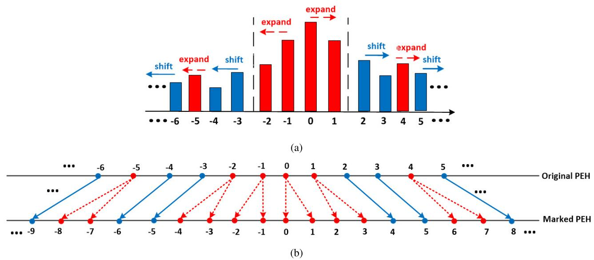
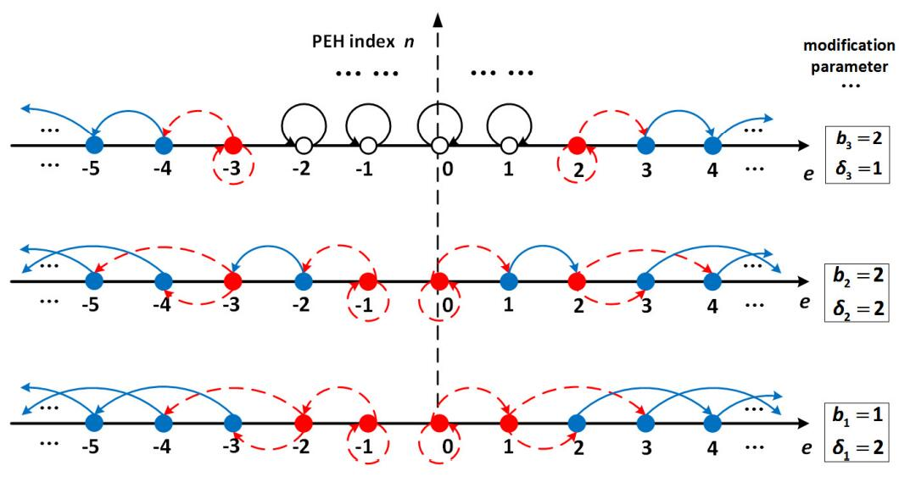
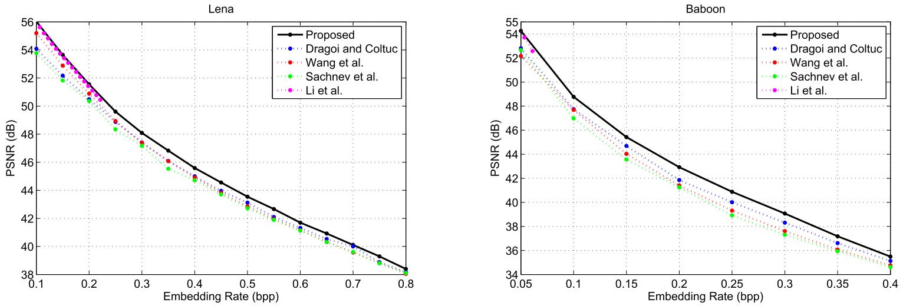
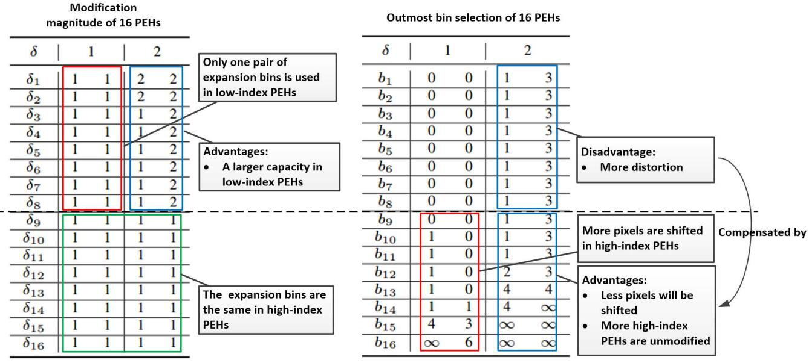

基于MHM的高容量RDH方法
=======


论文题目： "[High capacity reversible data hiding based on multiple histograms modification](https://ieeexplore.ieee.org/document/8733828)" (TCSVT 2021).


<p align="center">     </p>
<p align="center"> 图1: 提出的单个PEH修改方法示意. </p>


<p align="center">     </p>
<p align="center"> 图2:  提出的高容量 MHM 示例（ 最大修改量 δ = 2）. </p>


## 如何运行
下载项目源代码

```
打开 sourceFile 文件夹
运行 main_apt.m 文件
```

## 实验结果

<p align="center">     </p>
<p align="center"> 图3: 对比容量-失真性能. </p>

<p align="center">     </p>
<p align="center"> 图4: 0.25bpp下的参数对比（δ = 1 和 δ = 2）.</p>


## 实验环境
Matlab 2016b <br>


## 致谢
这项工作得到了国家重点研发项目（2016YFB0800404）的部分资助，国家自然科学基金项目（Nos. 61872128、61572052、61532005、61332012）的部分资助和中央高校基本科研业务费（2018JBZ001）的部分资助

## 引用格式
如果这项工作对您的研究有帮助, 请按如下格式引用：
```
@ARTICLE{8733828,
  author={Ou, Bo and Zhao, Yao},
  journal={IEEE Transactions on Circuits and Systems for Video Technology}, 
  title={High Capacity Reversible Data Hiding Based on Multiple Histograms Modification}, 
  year={2020},
  volume={30},
  number={8},
  pages={2329-2342},
  doi={10.1109/TCSVT.2019.2921812}}
```

## 版权声明
受欧博老师委托，本项目已开源 (详见 ``` MIT LICENSE ``` ).

